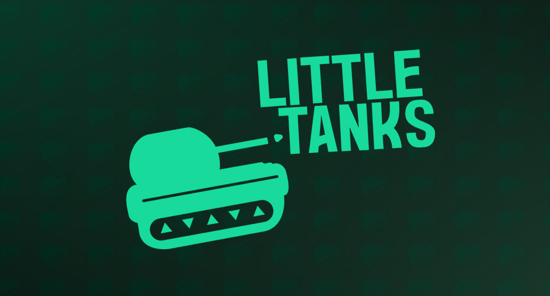

    
    

        <a href="#play-the-game-🎮">Play</a> ·
        <a href="#screenshots-📷">Screenshots</a> ·
        <a href="https://github.com/mianjoto/little-tanks/pulls?q=is%3Apr">Changelog</a> ·
        <a href="#contact">Contact</a>
    

    
</header>

# Little Tanks

Play as a little toy tank with tiny missiles and battle in a play arena. See how far you can get!

## Play the game 🎮

You can download and play Little Tanks here: **[https://mianjoto.itch.io/little-tanks](https://mianjoto.itch.io/little-tanks)**

## Screenshots 📷

> Note: Gameplay, visual effects, and features are subject to change. These screenshots may not be representative of the final product.

## Download 🌐

### Install steps:

1. Install the following requirements:
   - [Unity version 2021.3.10f1](https://unity3d.com/unity/qa/lts-releases)
   - [Microsoft .NET Framework 4.8](https://dotnet.microsoft.com/en-us/download/dotnet-framework/net48)
2. Clone the repository locally:

   `git clone https://github.com/mianjoto/little-tanks.git`

### Run locally:

1. Open Unity Hub
2. Click **Open > Add project from disk**
   
3. Locate the folder containing the [cloned repository](#install-steps) and click **Open**
4. Open the project
   

## Technologies used

Languages:

- C#, .NET Framework 4.8

## Attributions

- Developed in [Unity version 2021.3.10f1](https://unity3d.com/unity/qa/lts-releases)
- Imported assets used:
  - Customizable skybox - via [Key Mouse](https://assetstore.unity.com/packages/2d/textures-materials/sky/customizable-skybox-174576)
  - Kanopi Brazil font - via [dafont.com (Raxel Studio)](https://www.dafont.com/kanopi-brazil.font)
  - Textures and Materials - via [freepbr.com](https://freepbr.com/)

## Contact

    
    
Solo developed by <a href="https://github.com/mianjoto"><strong>Miguel Jover</strong></a>

    
Want to get in contact? Send me an email at <a href="mailto:mianjoto@gmail.com"><strong>mianjoto@gmail.com</strong></a>

---

   
Project Link: <a href="https://github.com/mianjoto/little-tanks">https://github.com/mianjoto/little-tanks</a>

